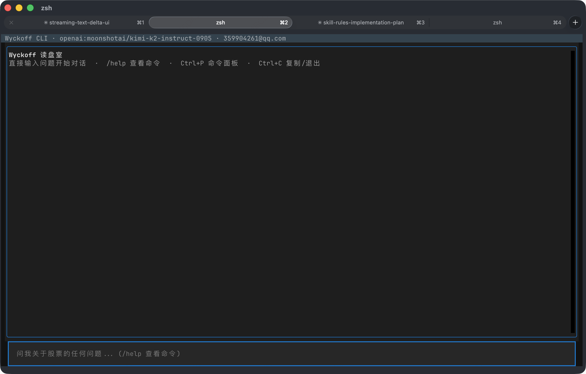
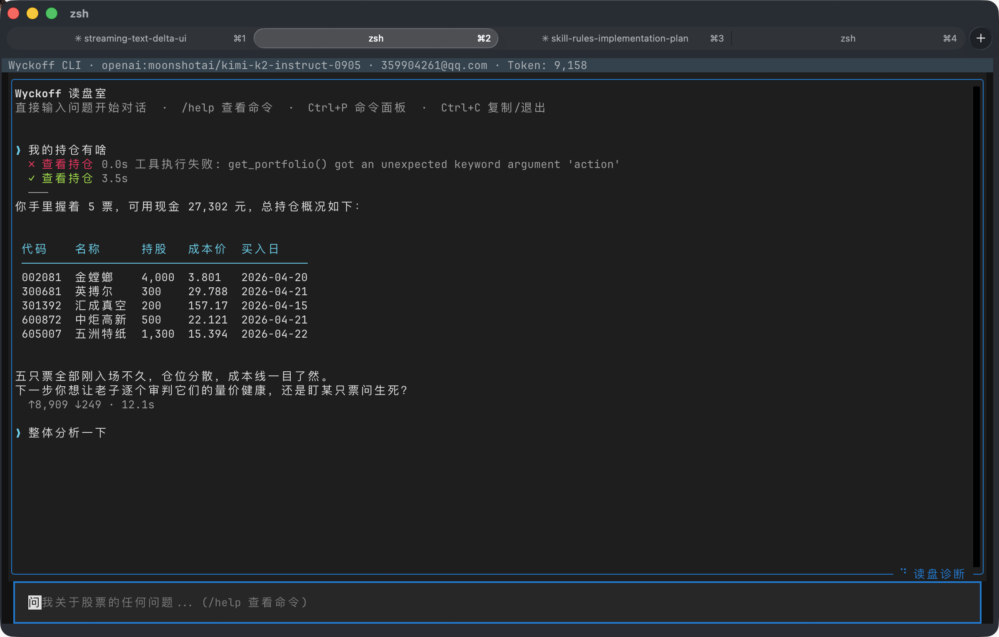
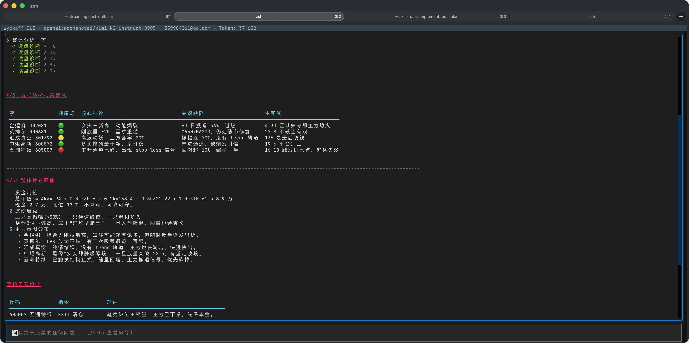
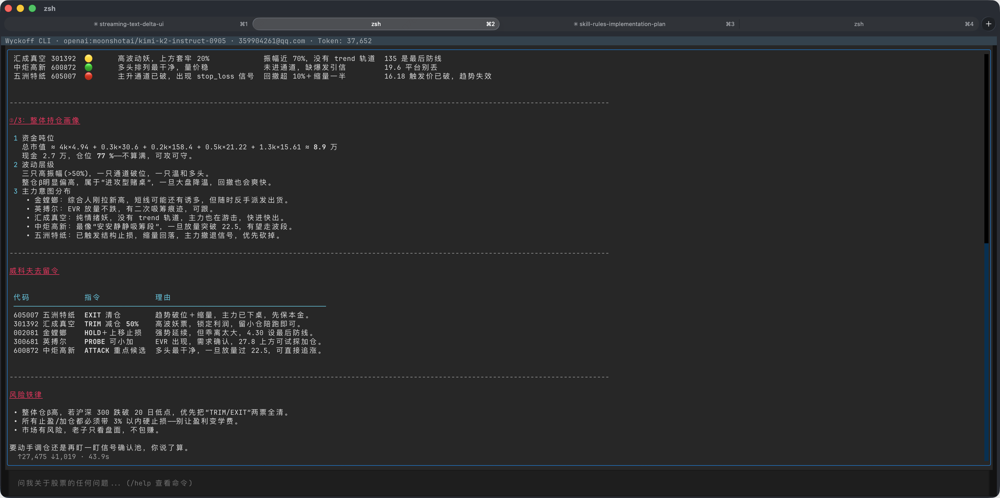
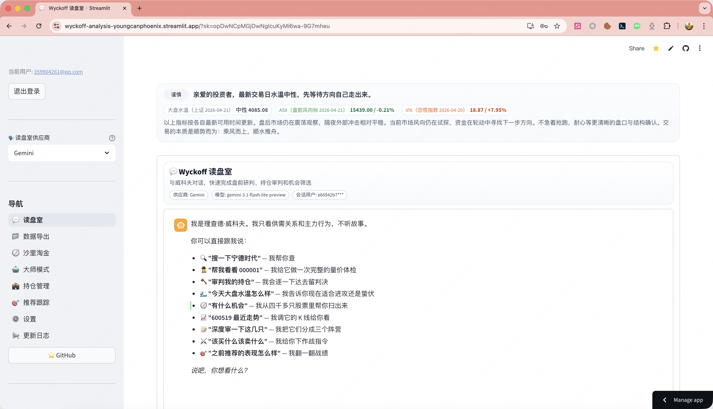
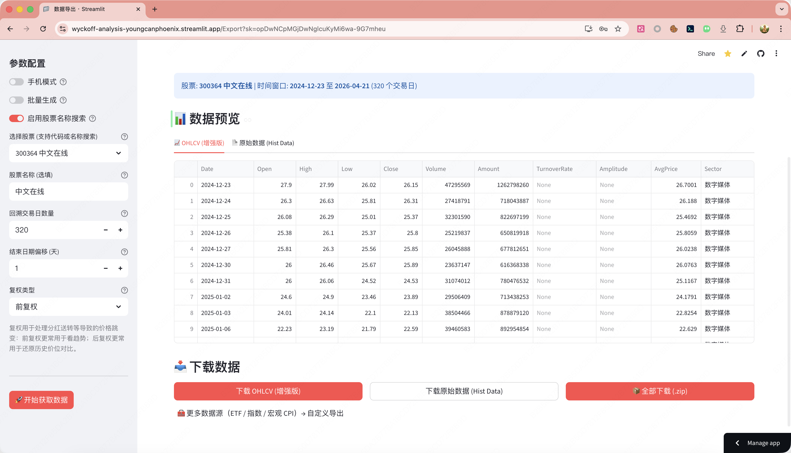

<div align="center">

# Wyckoff Trading Agent

**A 股威科夫量价分析智能体 — 你说人话，他读盘面**

[](https://pypi.org/project/youngcan-wyckoff-analysis/)
[](https://www.python.org/)
[](LICENSE)
[](https://wyckoff-analysis-youngcanphoenix.streamlit.app/)
[](https://youngcan-wang.github.io/wyckoff-homepage/)

[English](docs/README_EN.md) | [日本語](docs/README_JA.md) | [Español](docs/README_ES.md) | [한국어](docs/README_KO.md) | [架构文档](docs/ARCHITECTURE.md)

</div>

---

用自然语言和一位威科夫大师对话。他能调动 10 个量价工具，自主串联多步推理，给出"打还是不打"的结论。

Web + CLI 双通道，Gemini / Claude / OpenAI 三选一，GitHub Actions 定时全自动。

项目主页：**[youngcan-wang.github.io/wyckoff-homepage](https://youngcan-wang.github.io/wyckoff-homepage/)**

## 功能一览

| 能力 | 说明 |
|------|------|
| 对话式 Agent | 用自然语言触发诊断、筛选、研报，LLM 自主编排工具调用；还能读写文件、执行命令、抓取网页，帮你操作电脑 |
| 五层漏斗筛选 | 全市场 ~4500 股 → ~30 候选，六通道 + 板块共振 + 微观狙击 |
| AI 三阵营研报 | 逻辑破产 / 储备营地 / 起跳板，LLM 独立审判 |
| 持仓诊断 | 批量体检：均线结构、吸筹阶段、触发信号、止损状态 |
| 私人决断 | 综合持仓 + 候选，输出 EXIT/TRIM/HOLD/PROBE/ATTACK 指令，Telegram 推送 |
| 信号确认池 | L4 触发信号经 1-3 天价格确认后才可操作 |
| 推荐跟踪 | 历史推荐自动同步收盘价、计算累计收益 |
| 日线回测 | 回放漏斗命中后 N 日收益，输出胜率/Sharpe/最大回撤 |
| 盘中持仓监控 | TickFlow 实时行情驱动，止损穿破 / 跳空低开 / 放量滞涨 / VWAP 破位四维预警 |
| 盘前风控 | A50 + VIX 监测，四档预警推送 |
| 通用 Agent 能力 | 执行命令、读写文件、抓取网页 — 发一个 CSV 路径即可分析，不只是股票工具 |
| 多通道推送 | 飞书 / 企微 / 钉钉 / Telegram |

## 数据源

个股日线自动降级：

```
tickflow → tushare → akshare → baostock → efinance
```

任一源不可用时自动切换，无需干预。

> **推荐接入 TickFlow（高频/分时/实时能力更强）**
> 注册链接：[TickFlow注册链接](https://tickflow.org/auth/register?ref=5N4NKTCPL4)

## 快速开始

### 一键安装（推荐）

```bash
curl -fsSL https://raw.githubusercontent.com/YoungCan-Wang/Wyckoff-Analysis/main/install.sh | bash
```

自动检测 Python、安装 uv、创建隔离环境，装完直接 `wyckoff` 启动。

### Homebrew

```bash
brew tap YoungCan-Wang/wyckoff
brew install wyckoff
```

### pip

```bash
uv venv && source .venv/bin/activate
uv pip install youngcan-wyckoff-analysis
wyckoff
```

启动后：
- `/model` — 选择模型（Gemini / Claude / OpenAI），输入 API Key
- `/login` — 登录账号，打通云端持仓
- 直接输入问题开始对话

```
> 帮我看看 000001 和 600519 哪个更值得买
> 审判我的持仓
> 大盘现在什么水温
```

升级：`wyckoff update`

### CLI 效果

| 启动界面 | 持仓查询 |
|:---:|:---:|
|  |  |

| 诊断报告 | 操作指令 |
|:---:|:---:|
|  |  |

### Web

```bash
git clone https://github.com/YoungCan-Wang/Wyckoff-Analysis.git
cd Wyckoff-Analysis
python3 -m venv .venv && source .venv/bin/activate
pip install -r requirements.txt
streamlit run streamlit_app.py
```

在线体验：**[wyckoff-analysis-youngcanphoenix.streamlit.app](https://wyckoff-analysis-youngcanphoenix.streamlit.app/)**

| 读盘室 | 数据导出 |
|:---:|:---:|
|  |  |

## 16 个工具

Agent 的武器库 — 12 个量价工具 + 4 个通用能力：

| 工具 | 能力 |
|------|------|
| `search_stock_by_name` | 名称 / 代码 / 拼音模糊搜索 |
| `diagnose_stock` | 单股 Wyckoff 结构化诊断 |
| `diagnose_portfolio` | 批量持仓健康扫描 + 盘中实时信号 |
| `get_stock_price` | 近期 OHLCV 行情 |
| `get_market_overview` | 大盘水温概览 |
| `screen_stocks` | 五层漏斗全市场筛选 |
| `generate_ai_report` | 三阵营 AI 深度研报 |
| `generate_strategy_decision` | 持仓去留 + 新标买入决策 |
| `get_recommendation_tracking` | 历史推荐及后续表现 |
| `get_signal_pending` | 信号确认池查询 |
| `exec_command` | 执行本地 shell 命令 |
| `read_file` | 读取本地文件（CSV/Excel 自动解析） |
| `write_file` | 写入文件（导出报告/数据） |
| `web_fetch` | 抓取网页内容（财经新闻/公告） |

工具调用顺序和次数由 LLM 实时决策，无需预编排。发一个 CSV 路径他就能读；说"帮我装个包"他就能执行。

## 五层漏斗

| 层 | 名称 | 做什么 |
|----|------|--------|
| L1 | 剥离垃圾 | 剔除 ST / 北交所 / 科创板，市值 ≥ 35 亿，日均成交 ≥ 5000 万 |
| L2 | 六通道甄选 | 主升 / 点火 / 潜伏 / 吸筹 / 地量 / 护盘 |
| L3 | 板块共振 | 行业 Top-N 分布筛选 |
| L4 | 微观狙击 | Spring / LPS / SOS / EVR 四大触发信号 |
| L5 | AI 审判 | LLM 三阵营分类：逻辑破产 / 储备 / 起跳板 |

## 每日自动化

仓库内置 GitHub Actions 定时任务：

| 任务 | 时间（北京） | 说明 |
|------|-------------|------|
| 漏斗筛选 + AI 研报 + 私人决断 | 周日-周四 18:25 | 全自动，结果推送飞书/Telegram |
| 盘前风控 | 周一-周五 08:20 | A50 + VIX 预警 |
| 涨停复盘 | 周一-周五 19:25 | 当日涨幅 ≥ 8% 复盘 |
| 推荐跟踪重定价 | 周日-周四 23:00 | 同步收盘价 |
| 缓存维护 | 每天 23:05 | 清理过期行情缓存 |

## 模型支持

**CLI**：Gemini / Claude / OpenAI，`/model` 一键切换，支持任意 OpenAI 兼容端点。

**Web / Pipeline**：Gemini / OpenAI / DeepSeek / Qwen / Kimi / 智谱 / 火山引擎 / Minimax，共 8 家。

## 配置

复制 `.env.example` 为 `.env`，最少配置：

| 变量 | 说明 |
|------|------|
| `SUPABASE_URL` / `SUPABASE_KEY` | 登录与云端同步 |
| `GEMINI_API_KEY`（或其他厂商 Key） | LLM 驱动 |

可选配置：`TICKFLOW_API_KEY`（TickFlow 实时/分时数据，日线主链路优先）、`TUSHARE_TOKEN`（高级数据次优先回退）、`FEISHU_WEBHOOK_URL`（飞书推送）、`TG_BOT_TOKEN` + `TG_CHAT_ID`（Telegram 私人推送）。

> Tushare 注册推荐：[此链接注册](https://tushare.pro/weborder/#/login?reg=955650)，双方可提升数据权益。

完整配置项和 GitHub Actions Secrets 说明见 [架构文档](docs/ARCHITECTURE.md)。

## Wyckoff Skills

轻量复用威科夫分析能力：[`YoungCan-Wang/wyckoff_skill`](https://github.com/YoungCan-Wang/wyckoff_skill.git)

适合给 AI 助手快速挂载一套"威科夫视角"。

`Settings` → `Secrets and variables` → `Actions`，添加：

| 名称 | 必填 | 说明 |
|------|------|------|
| `GEMINI_API_KEY` | 是 | AI 研报与对话 Agent（或使用 `DEFAULT_LLM_PROVIDER` + 对应厂商 Key） |
| `TUSHARE_TOKEN` | 是 | 行情与市值数据 |
| `DEFAULT_LLM_PROVIDER` | 否 | 定时任务使用的厂商：`gemini` / `openai` / `zhipu` / `minimax` / `deepseek` / `qwen`，未配则 `gemini` |
| `FEISHU_WEBHOOK_URL` | 否 | 飞书推送地址，未配则跳过飞书通知 ([配置教程](https://open.feishu.cn/community/articles/7271149634339422210)) |
| `WECOM_WEBHOOK_URL` | 否 | 企微群机器人 Webhook |
| `DINGTALK_WEBHOOK_URL` | 否 | 钉钉自定义机器人 Webhook |
| `GEMINI_MODEL` | 否 | 未配则用默认模型；其他厂商可配 `OPENAI_MODEL`、`ZHIPU_MODEL` 等 |
| `SUPABASE_URL` | Step4 用 | 否（走 `USER_LIVE:<user_id>` 路径时需要） |
| `SUPABASE_KEY` | ❌ | Supabase 匿名 Key；脚本侧可作为读取兜底。 |
| `SUPABASE_SERVICE_ROLE_KEY` | ❌ | Supabase 管理员 Key；若 Step4 需要稳定读写，建议优先配置。 |
| `SUPABASE_USER_ID` | ❌ | **用户锁定**：指定 Step4 运行的目标用户 ID。 |
| `MY_PORTFOLIO_STATE` | ❌ | **本地账本兜底**：若 `USER_LIVE:<user_id>` 不可用，可用 JSON 字符串配置持仓 (格式见 `.env.example`)。 |
| `TG_BOT_TOKEN` | ❌ | **私密推送**：Telegram Bot Token，用于接收私密交易建议。 |
| `TG_CHAT_ID` | ❌ | Telegram Chat ID。 |
| `TAVILY_API_KEY` | ❌ | **防雷**：用于 RAG 新闻检索 (Tavily)，推荐配置。 |
| `SERPAPI_API_KEY` | ❌ | **防雷备用**：Tavily 挂了时自动切换到 Google News (SerpApi)。 |

> **提示**：以上配置只在你需要对应功能时才需填写。最基础运行仅需 `GEMINI_API_KEY` + `TUSHARE_TOKEN`。IM 通知渠道（飞书/企微/钉钉）均为可选，未配置时筛选和研报仍正常执行，仅跳过消息推送。

### 美股 S&P500 定时链路

仓库现在内置了一条独立的 US 数据维护链路，不再要求你手工维护 `US_FUNNEL_SYMBOLS` 这种逗号分隔 secret。

相关工作流：

- `.github/workflows/us_sp500_bootstrap.yml`：初始化任务，一次性回填当前 S&P500 成分股近 360 个交易日核心日线到 `stock_hist_cache`
- `.github/workflows/us_sp500_constituent_sync.yml`：每月同步一次 S&P500 成分股，并为新增成分股补历史数据
- `.github/workflows/us_daily_bar_refresh.yml`：每日为当前成分股补短窗口日线，用于补齐最新完整日 bar
- `.github/workflows/wyckoff_funnel_us.yml`：先同步 snapshot、再预热缓存、最后跑 US funnel

当前 US 版 funnel 的口径是：

- 股票池：S&P500 成分股
- 基准：`SPY`（主基准）+ `IWM`（小盘对照）
- 需要的数据：完整日 bar（OHLCV），并派生 `amount / pct_chg / amplitude`
- 不使用：A 股版行业层 / 市值层

当前推荐的调优参数都放在 workflow `env` 里，而不是写死在代码里：

- `US_SP500_BATCH_SIZE`
- `US_SP500_SLEEP_SECONDS`
- `US_SP500_BOOTSTRAP_DAYS`
- `US_SP500_SYNC_BOOTSTRAP_DAYS`
- `US_REFRESH_TRADING_DAYS`
- `FUNNEL_PREWARM_DAYS`

如果你发现 `yfinance` 在 500 只规模下偶发限流或空返回，优先调小 `US_SP500_BATCH_SIZE`，其次适当增大 `US_SP500_SLEEP_SECONDS`。

### Web 端后台任务所需 Streamlit Secrets

如果你希望在 Streamlit 页面里直接点按钮触发后台漏斗或后台批量 AI，还需要在 Streamlit Secrets 中配置：

| 名称 | 必填 | 说明 |
|------|------|------|
| `GITHUB_ACTIONS_TOKEN` | 是 | GitHub API Token，用于触发 `workflow_dispatch` 并读取 Actions 运行结果 artifact |
| `GITHUB_ACTIONS_REPO_OWNER` | 否 | 默认 `YoungCan-Wang` |
| `GITHUB_ACTIONS_REPO_NAME` | 否 | 默认 `Wyckoff-Analysis` |
| `GITHUB_ACTIONS_REF` | 否 | 默认 `main` |
| `GITHUB_ACTIONS_WORKFLOW_FILE` | 否 | 默认 `web_quant_jobs.yml` |
| `GITHUB_ACTIONS_ALLOWED_USER_IDS` | 否 | 逗号分隔的用户 ID 白名单；配置后仅白名单账号可在页面里触发后台任务 |

推荐使用**细粒度单仓库 Token**，至少授予：

- `Actions: Read and write`
- `Contents: Read`

### 验证

跑一次手动触发后，检查：

- 日志中有 `阶段汇总` 且 `ok=True`
- Artifacts 中有 `daily-job-logs-*`
- 飞书收到漏斗结果 + 研报

常规跑完约 90～130 分钟。报错时看日志里缺哪个配置。

### 日线回测（轻量）

不依赖分钟级和高价数据源，直接回放 Funnel 命中后的未来 N 日表现：

```bash
python -m scripts.backtest_runner \
  --start 2025-01-01 \
  --end 2025-12-31 \
  --hold-days 15 \
  --top-n 3 \
  --trading-days 320 \
  --board all \
  --exit-mode sltp \
  --stop-loss -9 \
  --take-profit 0 \
  --sample-size 300 \
  --output-dir analysis/backtest
```

当前脚本默认值是 `--hold-days 15 --top-n 3 --exit-mode sltp --stop-loss -9 --take-profit 0`。
交易日窗口默认是 `--trading-days 320`。若要做持有周期对比，建议分别回测 `15 / 30 / 45 / 60` 四档。

回测偏差口径说明（重要）：
- 默认**关闭**当前截面市值/行业映射过滤（降低 look-ahead bias）。
- 若你要复现旧口径，可显式加 `--use-current-meta`（会引入前视偏差，仅用于对比）。
- 无论是否开启，仍存在幸存者偏差（股票池来自当前在市名单）。
- 回测默认纳入双边摩擦成本：`--buy-friction-pct 0.2 --sell-friction-pct 0.2`（可按券商与滑点实况调整）。

输出文件：
- `summary_*.md`：收益统计 + 风险统计（最大回撤、VaR95、CVaR95、最长连亏）
- `trades_*.csv`：逐笔信号收益明细

### 常见报错

- `配置缺失: GEMINI_API_KEY`
  - 原因：未配置模型 Key 或已失效
  - 处理：更新 `GEMINI_API_KEY` 后重跑
- `市值数据为空（TUSHARE_TOKEN 可能缺失/失效）`
  - 原因：`TUSHARE_TOKEN` 缺失/失效/额度问题
  - 处理：检查并更新 `TUSHARE_TOKEN`，确认账号权限
- `[step3] 模型 ... 失败` / `llm_failed`
  - 原因：模型不可用、限流、网络抖动
  - 处理：更换 `GEMINI_MODEL` 或稍后重试
- `[step3] 飞书推送失败` / `feishu_failed`
  - 原因：Webhook 无效、限流、网络问题
  - 处理：重新生成飞书机器人 Webhook 并替换 Secret
- `Step4 私人再平衡: 跳过（SUPABASE_USER_ID 未配置/用户持仓缺失）`
  - 原因：未配置 `SUPABASE_USER_ID`，或 `USER_LIVE:<user_id>`/`MY_PORTFOLIO_STATE` 都不可用
  - 处理：在 Secrets 配置 `SUPABASE_USER_ID`；优先保证 Supabase 有 `USER_LIVE:<user_id>`，必要时提供 `MY_PORTFOLIO_STATE` 兜底
- `Step4 私人再平衡: 跳过（TG_BOT_TOKEN/TG_CHAT_ID 未配置）`
  - 原因：Telegram Secret 未配置
  - 处理：配置 `TG_BOT_TOKEN` 和 `TG_CHAT_ID` 后重跑
- `User location is not supported for the API use`
  - 原因：模型地域限制
  - 处理：更换可用网络出口或供应商
- `Action 超时或明显慢于 2 小时`
  - 原因：数据源抖动、重试变多
  - 处理：查看批次日志定位卡点，必要时手动重跑
- `US workflow 中 S&P500 snapshot 丢失 / added-removed diff 看起来不稳定`
  - 原因：GitHub runner 是冷启动，未命中上一次 `data/us_sp500_constituents.json` cache
  - 处理：这不影响功能，系统会自动 live fetch 当前成分股；若想降低波动，优先确认相关 US workflow 的 cache restore/save 正常执行

### 私人决断（可选）

Step4 完全由 GitHub Actions Secrets 驱动：读取 `SUPABASE_USER_ID` 定位 `USER_LIVE:<user_id>`，读取 `TG_BOT_TOKEN/TG_CHAT_ID` 推送 Telegram，模型使用 `GEMINI_API_KEY/GEMINI_MODEL`。若 Supabase 持仓缺失可用 `MY_PORTFOLIO_STATE` 做兜底。

---

## 交流

| 飞书群 | 飞书个人 |
|:---:|:---:|
|  |  |

## 赞助

觉得有帮助？给个 Star。赚到钱了？请作者吃个汉堡。

| 支付宝 | 微信 |
|:---:|:---:|
|  |  |

## License

[AGPL-3.0](LICENSE) &copy; 2024-2026 youngcan

---

## ☕ 赞助与支持

各位股友，觉得这个脚本筛选的股票形态很得您心，辛苦给个吆喝，点个star。如果这个借助这个脚本赚到钱了，也欢迎赞助作者一顿汉堡，升级下大模型和股票数据，非常感谢

| 支付宝 (Alipay) | 微信支付 (WeChat) |
| :---: | :---: |
|  |  |

---

## 🤖 系统架构

> **一个会思考的大脑 + 一条不知疲倦的流水线**

```
╔══════════════════════════════════════════════════════════════════════════════════════╗
║                      🏛️  WYCKOFF TRADING AGENT 3.1  ·  System Panorama             ║
╚══════════════════════════════════╤═══════════════════════════════════════════════════╝
                                   │
              ┌────────────────────┼────────────────────┐
              ▼                    ▼                    ▼
   ┌──────────────────┐ ┌──────────────────┐ ┌──────────────────┐
   │ Streamlit Web UI  │ │  CLI Terminal    │ │  GitHub Actions  │
   │ Reading Room      │ │  wyckoff cmd     │ │  cron Pipeline   │
   └────────┬─────────┘ └────────┬─────────┘ └────────┬─────────┘
            │                    │                     │
            ▼                    ▼                     ▼
┌───────────────────────────────────┐     ┌───────────────────────────────────┐
│      🧠 AGENT BRAIN               │     │      ⚙️  ETL PIPELINE              │
│  Web: Google ADK  ·  CLI: 裸写    │     │      GitHub Actions  ·  cron      │
│                                   │     │                                   │
│  ┌─────────────────────────────┐  │     │  ┌─────────────────────────────┐  │
│  │      wyckoff_advisor        │  │     │  │  Step 2  Funnel Screening   │  │
│  │      LlmAgent               │  │     │  │  Step 3  AI Battle Report   │  │
│  │      Wyckoff Master Persona │  │     │  │  Step 4  Rebalance & Push   │  │
│  │                             │  │     │  └─────────────────────────────┘  │
│  │  Intent → Tools → Reason   │  │     │                                   │
│  │  Autonomous  Multi-step     │  │     │  Sun-Thu 18:25 CST  ·  Manual    │
│  └──────────────┬──────────────┘  │     │  Deterministic  ·  No autonomy   │
│                 │                  │     └────────────────┬──────────────────┘
│  ┌──────────────┴──────────────┐  │                      │
│  │   9 FunctionTools Arsenal   │  │                      │
│  │                             │  │                      │
│  │  search    diagnose  port.  │  │                      │
│  │  price     overview  funnel │  │                      │
│  │  report    strategy  track  │  │                      │
│  └──────────────┬──────────────┘  │                      │
└─────────────────┼─────────────────┘                      │
                  │                                        │
                  └──────────────┬──────────────────────────┘
                                 │
              ┌──────────────────┴──────────────────┐
              │         🔧 CORE ENGINE               │
              │                                      │
              │  wyckoff_engine ····· 5-Layer Funnel  │
              │  funnel_pipeline ··· Market Sweep     │
              │  batch_report ······ 3-Camp Verdict   │
              │  strategy ·········· Trade Decision   │
              │  holding_diagnostic  Health Check     │
              │  prompts ··········· Prompt Arsenal   │
              │  sector_rotation ··· Sector Radar     │
              └───────┬──────────────┬────────┬──────┘
                      │              │        │
           ┌──────────┘              │        └──────────┐
           ▼                         ▼                   ▼
┌────────────────────┐  ┌────────────────────┐  ┌────────────────────┐
│  📡 DATA SOURCES   │  │   🤖 LLM  x 8     │  │  ☁️  CLOUD STORE   │
│                    │  │                    │  │                    │
│  tushare      ★   │  │  Gemini       ★   │  │  Supabase          │
│    ↓ akshare      │  │  OpenAI           │  │    Portfolio       │
│    ↓ baostock     │  │  DeepSeek         │  │    Recommendation  │
│    ↓ efinance     │  │  Qwen · Kimi      │  │    Settings        │
│                    │  │  Zhipu · Volc     │  │    Hist Cache      │
│  auto-fallback    │  │  Minimax           │  │                    │
└────────────────────┘  └─────────┬──────────┘  └────────────────────┘
                                  │
              ┌───────────────────┴───────────────────┐
              │           📣 NOTIFICATIONS             │
              │                                        │
              │  Feishu  ·  WeCom  ·  DingTalk  ·  TG  │
              └────────────────────────────────────────┘
```

### Agent 决策流详解

用户说一句话，Agent 自主完成全部推理——**零预编排，纯 LLM 实时决策**：

```
 "帮我看看 000001 和 600519 哪个更值得买"
                    │
                    ▼
  ┌─────────────────────────────────────────────────────────────────┐
  │  wyckoff_advisor  (Google ADK LlmAgent)                         │
  │                                                                 │
  │  1. 理解意图 ──→ "用户要对比两只股票"                             │
  │                                                                 │
  │  2. 自主调度 ──→ diagnose_stock("000001.SZ")  ──→ 吸筹末期      │
  │              ──→ diagnose_stock("600519.SH")  ──→ Markup 中段   │
  │              ──→ get_stock_price("000001.SZ") ──→ 近期量价      │
  │              ──→ get_stock_price("600519.SH") ──→ 近期量价      │
  │                                                                 │
  │  3. 综合推理 ──→ 对比结构、量价、风险收益比                       │
  │                                                                 │
  │  4. 输出结论 ──→ "000001 处于 Spring 确认阶段，胜率更高..."       │
  └─────────────────────────────────────────────────────────────────┘
```

### 会话管理

| 层级 | 实现 | 说明 |
|------|------|------|
| Session | `InMemorySessionService` | 进程内存储，重启丢失 |
| State | `session.state` | 存储 `user_id`、偏好 provider 等上下文 |

### Pipeline 执行流

定时全市场筛选（`.github/workflows/wyckoff_funnel.yml`），确定性 ETL + 两次 LLM 调用：

```
  cron (Sun-Thu 18:25 CST) / manual dispatch
    │
    │   ┌──────────────────────────────────────────────────────────┐
    ├──→│ Step 2 ·  FUNNEL                                         │
    │   │ Market Regime + ~4500 A-shares OHLCV → 5-layer → ~30    │
    │   └──────────────────────────────────────────────────────────┘
    │
    │   ┌──────────────────────────────────────────────────────────┐
    ├──→│ Step 3 ·  REPORT                                         │
    │   │ Prompt + 1x LLM call → 3-camp Markdown battle report    │
    │   └──────────────────────────────────────────────────────────┘
    │
    │   ┌──────────────────────────────────────────────────────────┐
    └──→│ Step 4 ·  REBALANCE                                      │
        │ Prompt + 1x LLM call → Hold/Sell/Buy JSON → OMS → Push  │
        └──────────────────────────────────────────────────────────┘
```

| 步骤 | 代码模块 | 本质 |
|------|---------|------|
| Funnel + Regime | `core/funnel_pipeline.py` → `wyckoff_engine.py` + `market_regime.py` | 确定性量价计算 |
| Report | `step3_batch_report.py` → `core/batch_report.py` | 单次 LLM 调用 |
| Rebalance | `step4_rebalancer.py` → `core/strategy.py` | 单次 LLM + OMS 风控 |

### LLM Provider（8 大厂商全通）

- **Web Agent**：默认 Gemini（ADK 原生），可通过 LiteLLM 桥接切换
- **CLI Agent**：Gemini / Claude / OpenAI 三选一，TUI 内 `/model` 切换，支持任意 OpenAI 兼容端点
- **Pipeline**：通过 `llm_client.py` 多 provider 直连

| Provider | 状态 | 说明 |
|----------|------|------|
| Gemini | ✅ 主力 | Agent `gemini-2.5-flash` / Pipeline `gemini-3.1-flash-lite-preview` |
| OpenAI | ✅ | GPT-4o / GPT-4o-mini |
| DeepSeek | ✅ | DeepSeek-Chat |
| Qwen | ✅ | DashScope OpenAI-compatible |
| Kimi | ✅ | moonshot-v1 |
| Zhipu | ✅ | GLM-4 |
| Volcengine | ✅ | Doubao/ARK |
| Minimax | ✅ | abab 系列 |

---

## 附录

### 目录结构

```text
.
├── streamlit_app.py        # Web 入口 — 智能对话首页（Google ADK Chat Agent）
├── app/                    # UI 组件（layout/auth/navigation）
│   ├── background_jobs.py  # Streamlit 侧后台任务状态管理
│   └── ...
├── cli/                    # 🖥️ 终端 CLI Agent（裸写，零框架）
│   ├── __main__.py         # 入口：wyckoff 命令 / python -m cli
│   ├── agent.py            # 核心 Agent 循环（think → tool_call → execute → think）
│   ├── providers/          # 多模型适配层
│   │   ├── base.py         # LLMProvider 抽象接口
│   │   ├── gemini.py       # Gemini（google-genai SDK）
│   │   ├── claude.py       # Claude（anthropic SDK）
│   │   └── openai.py       # OpenAI（openai SDK，支持自定义 base_url）
│   ├── auth.py             # 认证（Supabase 登录 + session 持久化）
│   ├── tools.py            # 工具注册表（复用 chat_tools.py，ToolContext shim）
│   └── ui.py               # 终端 UI（rich Markdown + prompt_toolkit）
├── agents/                 # 🤖 对话 Agent 层（Google ADK）
│   ├── wyckoff_chat_agent.py # 对话 Agent 定义（ADK LlmAgent，威科夫人格）
│   ├── chat_tools.py       # 9 个 FunctionTool — 包装引擎能力给对话 Agent
│   └── session_manager.py  # 会话管理（ADK Runner + InMemorySessionService）
├── core/                   # 核心策略与领域逻辑
│   ├── wyckoff_engine.py   # Wyckoff 多层漏斗引擎（六通道L2 + Markup L2.5）
│   ├── prompts.py          # AI 提示词（投委会 / 漏斗 / 私人决断 / 对话 Agent）
│   ├── sector_rotation.py  # 板块轮动分析
│   ├── holding_diagnostic.py # 持仓诊断
│   ├── stock_cache.py      # 股票数据缓存
│   └── constants.py        # 常量定义
├── integrations/           # 数据源/LLM/Supabase 适配层
│   ├── data_source.py      # 统一数据源（akshare → baostock → efinance → tushare）
│   ├── llm_client.py       # LLM 客户端（原生多 provider）
│   ├── stock_hist_repository.py # Supabase 缓存 + gap-fill
│   ├── supabase_client.py  # Supabase 云端同步
│   ├── supabase_portfolio.py # 策略持仓同步
│   ├── supabase_recommendation.py # 推荐跟踪
│   ├── rag_veto.py         # RAG 防雷模块
│   └── github_actions.py   # GitHub Actions 触发与结果查询
├── pages/                  # Streamlit 页面
│   ├── Export.py           # 数据导出（A 股 CSV + 跳转自定义导出）
│   ├── AIAnalysis.py       # 大师模式（单股深度分析 + 图表生成）
│   ├── WyckoffScreeners.py # 沙里淘金（后台漏斗筛选，高级参数调优）
│   ├── Portfolio.py        # 持仓管理
│   ├── RecommendationTracking.py # 推荐跟踪
│   ├── CustomExport.py     # 自定义导出（ETF/指数/宏观 CPI）
│   ├── Settings.py         # 设置
│   └── Changelog.py        # 版本更新日志
├── scripts/
│   ├── daily_job.py        # 定时任务入口（GH Actions cron 调用）
│   ├── wyckoff_funnel.py   # 全市场漏斗筛选
│   ├── step3_batch_report.py  # AI 研报
│   ├── step4_rebalancer.py    # 私人决断
│   ├── web_background_job.py  # Web 后台任务执行入口
│   ├── premarket_risk_job.py  # 盘前风控预警
│   └── backtest_runner.py  # 日线轻量回测
├── tools/                  # 可复用工具函数（Agent / scripts 共享）
│   ├── data_fetcher.py     # 数据拉取辅助
│   ├── report_builder.py   # 研报拼装辅助
│   ├── debug_io.py         # 模型输入落盘（DEBUG_MODEL_IO）
│   └── ...
├── tests/
│   ├── agents/             # Agent 层测试
│   └── ...                 # 现有单元测试
├── requirements.txt
└── .env.example
```

### 盘前风险与市场信号栏

- 盘前风控任务会综合 `A50 + VIX` 判断外部风险，并输出 `NORMAL / CAUTION / RISK_OFF / BLACK_SWAN` 四档结果。
- Web 端会将"盘后大盘水温"与"盘前外部风险"融合成一条顶部市场信号栏，统一按"最新交易日"口径展示，不要求用户理解内部工程标签。
- 页面展示采用 A 股常用颜色习惯：上涨偏红、下跌偏绿；VIX 恐慌抬升也会按防守方向显示。

### 交易日与时间窗口

按交易日计算，自动跳过周末与节假日。

- 结束日（北京时间口径）：
  - `17:00-23:59` → 取 `T`（当天）
  - `00:00-16:59` → 取 `T-1`（上一自然日）
- 最终会对齐到最近交易日（自动跳过周末与节假日）
- 开始日：从结束日向前回溯 N 个交易日（默认 320）
- 参数：`--trading-days`、`--end-offset-days`

### CSV 输出说明

- **hist_data.csv**：akshare 原始字段（日期、开高低收、成交量、成交额、振幅、换手率等）
- **ohlcv.csv**：增强版（OHLCV + 均价、行业），便于回测与可视化

### 复权

`--adjust`：`""` 不复权，`qfq` 前复权，`hfq` 后复权。

```bash
python -m integrations.fetch_a_share_csv --symbol 300364 --adjust qfq
```

### 常见问题

- **ImportError: create_client from supabase** → `pip install supabase>=2.0.0`
- **macOS pip externally-managed-environment** → 用虚拟环境安装依赖
- **文件名有空格** → 股票名本身带空格，脚本会做安全替换

### AI 分析：Alpha 虚拟投委会

Web 端提供「AI 分析」页面，采用「Alpha」虚拟投委会模式，由七位历史级交易大师人格共同决策。

当前执行口径：

- **对话式分析**：通过首页智能对话，用自然语言触发个股诊断、研报生成等分析能力
- **单股分析**：在 AI 分析页面内本地执行，适合轻量、即时交互
- **批量代码分析**：改为 GitHub Actions 后台执行
- **漏斗候选分析**：先在后台 Funnel 页得到候选，再在 AI 页提交后台批量研报

对话式分析和单股分析保留即时性，批量 OHLCV 和模型上下文从 Community Cloud 内存里移走。

大师分工如下：

| 大师 | 职责 |
|------|------|
| 🌊 **道氏与艾略特** | 宏观定势，判断牛市/熊市主趋势 |
| 💰 **彼得·林奇** | 价值透视，PEG 估值，六大股票分类 |
| 🕵️ **理查德·威科夫** | 主力侦察，吸筹/派发阶段判断，供需法则 |
| 📐 **缠中说禅** | 结构精算，中枢、背驰、买卖点数学定位 |
| 🔥 **情绪流龙头战法** | 情绪博弈，周期定位，龙头识别 |
| 🐊 **杰西·利弗莫尔** | 关键时机，关键点突破确认 |
| 🕯️ **史蒂夫·尼森** | 微观信号，蜡烛图反转形态 |

### RAG 防雷（负面舆情过滤）

每日选股流程中集成 RAG 防雷模块，自动过滤有负面舆情的股票：

- **数据源**：Tavily 新闻搜索（如未配置则跳过）
- **默认负面关键词**：立案、调查、证监会、处罚、违规、造假、退市、减持、质押爆仓、债务违约、业绩预亏、业绩下滑、商誉减值、诉讼、仲裁、冻结等
- **配置**：`TAVILY_API_KEY` 环境变量

### 数据源降级机制

个股日线当前优先使用 AKShare（固定前复权 `qfq`），失败时依次降级：

```
akshare → baostock → efinance
```

- A 股大盘指数当前优先使用 `yfinance`，但仅在历史覆盖足够时采用；若返回明显不足的历史（例如仅 1 行），会自动回退到 AKShare
- 当前本地验证稳定可用的 A 股指数 ticker：
  `000001 -> 000001.SS`（上证指数）
  `399001 -> 399001.SZ`（深证成指）
  `000300 -> 000300.SS`（沪深300）
- 当前在 `yfinance` 上历史覆盖不足、会自动回退 AKShare 的 A 股指数包括：
  `399006 -> 399006.SZ`（创业板指）
  `000905 -> 000905.SS`（中证500）
  `000688 -> 000688.SS`（科创50）
- 可通过环境变量按需禁用各源：`DATA_SOURCE_DISABLE_AKSHARE=1` / `DATA_SOURCE_DISABLE_BAOSTOCK=1`

### 自定义导出支持的数据源

| 数据源 | 说明 | 复权支持 |
|--------|------|----------|
| A股个股历史 | 日线 K 线，6 位代码 | ✅ |
| 指数历史 | 上证/深证/创业板/北证 | ❌ |
| ETF 历史 | 510300 / 159707 等 | ✅ |
| 宏观 CPI | 月度 CPI 指标 | ❌ |

美股单股导出
python -m integrations.fetch_a_share_csv --market us --symbol AAPL --trading-days 320

美股多股导出
python -m integrations.fetch_a_share_csv --market us --symbols AAPL MSFT NVDA

### Fork 与部署

1. Fork 本仓库，克隆到本地
2. 按上文配置 `.env` 后运行
3. 部署到 [Streamlit Cloud](https://share.streamlit.io/)：入口选 `streamlit_app.py`
4. 至少配置 `SUPABASE_URL`、`SUPABASE_KEY`、`COOKIE_SECRET`
5. 若要启用页面内的后台漏斗/后台批量 AI，再额外配置 `GITHUB_ACTIONS_TOKEN`

[](https://share.streamlit.io/)

---

## 版本更新

详见 [`CHANGELOG.md`](CHANGELOG.md)。Web 端「版本更新日志」页面直接读取该文件。

---

**开源协议 | License**

本项目基于 [GNU Affero General Public License v3.0 (AGPL-3.0)](LICENSE) 开源。

- ✅ 个人学习、研究、自用：自由使用
- ✅ 修改和再分发：需保持同样的 AGPL-3.0 协议并开源
- ✅ 通过网络提供服务（SaaS）：必须向用户公开完整源代码
- 📧 **联系方式**：可通过微信/飞书，或 GitHub Issue 联系

Copyright (c) 2024-2026 youngcan.

---

## Star History
[](https://star-history.com/#YoungCan-Wang/Wyckoff-Analysis&Date)
